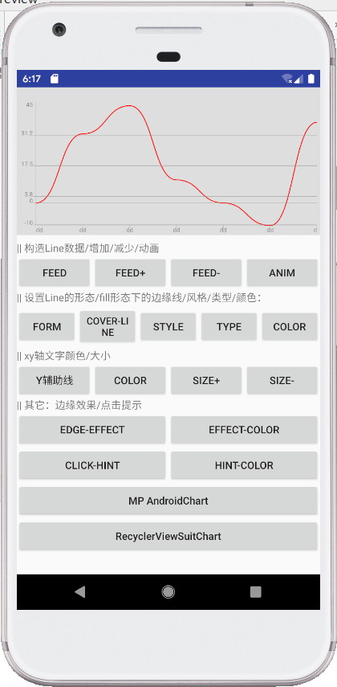
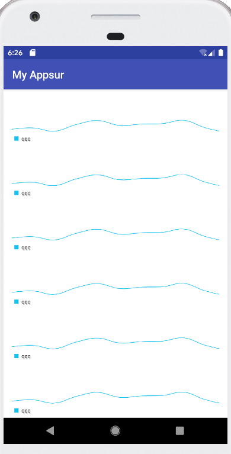
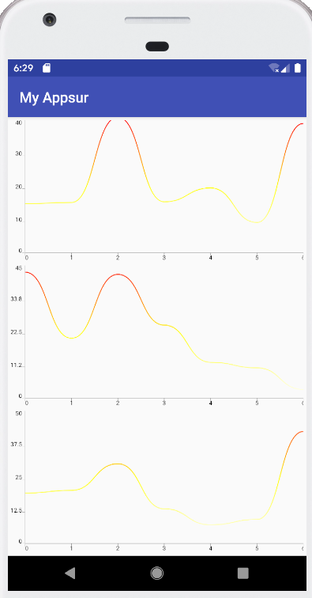

# Preview-Homework
## 1.作业原因
大创项目需要用到显示波形的空间，正好在GitHub上找到了两个图片控件，学习了一下，稍微写点展示一下。
## 2.图片展示
在SuitChart的主界面上添加了两个按钮。跳转到这两个控件与RecyclerView结合实现列表布局。均可实现水平滑动和垂直滚动

#### 1.MP AndroidChart+RecyclerView

#### 2.SuitChart+RecyclerView
